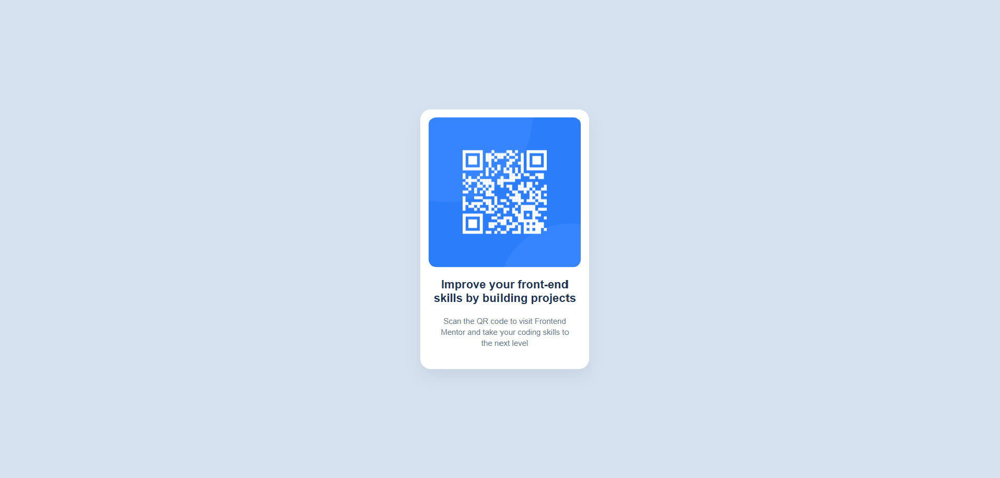

# 🌐 QR-Code

This is a solution to the [Frontend Mentor](https://www.frontendmentor.io) challenge.  
The goal of this project was to practice **HTML and CSS** by building a responsive page. 

---

## 🛠 Technology used
- HTML5  
- CSS3  

---

## 🚀 Demo

🔗 [Check the online page](https://leonardolaz01.github.io/QR-Code/)  

---

## 🛠 Technology used
- HTML5  
- CSS3  

---

## 📂 Project Estructure
📦 QR-Code
┣ 📜 index.html
┣ 📜 style.css
┣ 📜Images
┗ 📜 README.md 
